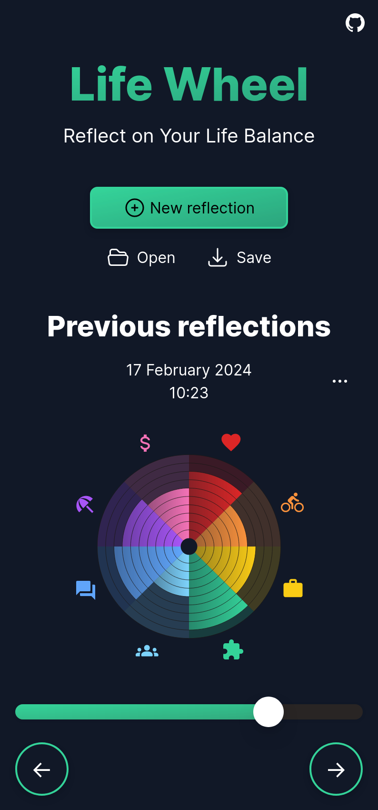

# Life Wheel

> Offline-first, privacy-friendly web app for your personal well-being.

Reflect on your life balance. Visualise your progress over time and reconnect to what matters in your life. Make reflection a habit and gain new insights for your well-being.

Seamlessly sync your data across devices with a private link (using the [URI fragment](https://en.wikipedia.org/wiki/URI_fragment) = never sent to the server), QR code, or file. For more security and privacy, let the app generate a passphrase and encrypt your data using the [Web Crypto API](https://developer.mozilla.org/en-US/docs/Web/API/Web_Crypto_API). Experience how smooth the modern web can be!

[>> DEMO LINK](https://reconnect.earth/lifewheel)

## Project Vision and Key Features

-   🧘 Reflect on your life balance.
-   🌱 Follow your progress over time and reconnect to what matters in your life.
-   📊 Make reflection a habit and gain new insights for your well-being.
-   👌 Keep 100% control of your private data.
-   😇 No signup or account needed. Designed to be used offline.
<!-- -   📲 Install the Progressive Web App to reflect on the go. -->
-   📥 Seamless file exports and imports, giving you full control over data syncing and backups. Integrates well with services like [Nextcloud](https://nextcloud.com/) and [Syncthing](https://syncthing.net/).
-   🔐 Optionally encrypt your data using the [Web Crypto API](https://developer.mozilla.org/en-US/docs/Web/API/Web_Crypto_API) to improve your security and privacy. Let the app generate a strong passphrase - or choose your own.
-   🔗 Save your data as a private link (using the [URI fragment](https://en.wikipedia.org/wiki/URI_fragment) which is never sent to the server). Store your link somewhere safe (for example in your password manager), or save your QR code.
-   ✨ Easily access your data on any device by clicking your private link or by scanning your QR code.
-   ⌨️ Keyboard shortcuts (primarily with the arrow keys) for extra comfort.
-   🆓 Free as in freedom. This is [free software](https://fsfe.org/freesoftware/), and you're welcome to help make it even better!

Designed with inspiration from the [Humane Tech](https://www.humanetech.com/) principles, this project explores the possibilities of offline-first web apps. Specifically - is it possible to give users full control over their private data, while still providing a smooth user experience? For the answer... well, you have to see it yourself! 😄

**Now check out the [live demo](https://reconnect.earth/lifewheel)!**

## License

AGPL-3.0
